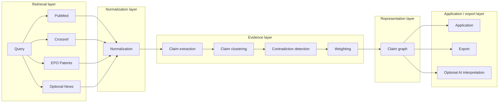
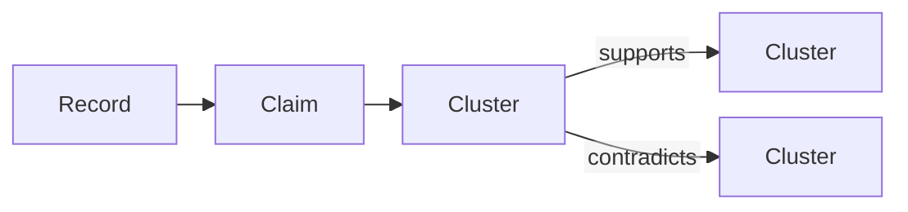

# Atlas — from search to working with evidence as a system

When I work with a new topic, I don’t think in terms of “searching”.

There is usually already some structure in my head — a hypothesis, a direction, something that doesn’t fully hold yet. And to move it forward, I end up moving across multiple types of sources almost automatically.

Papers give you one kind of signal.  
Patents a completely different one.  
Metadata somewhere in between.

You don’t really choose between them. You need all of them.

The friction starts immediately.

You run the same query in multiple places, but what comes back never quite aligns. Titles, abstracts, classifications, citation graphs — each system exposes a different slice. So you start doing the alignment yourself.

You read. You compare. You discard. You keep a few things in mind. You open another tab.

At some point, you form a view. But it lives entirely in your head. If you had to reconstruct it a day later, you would not do it the same way.

That is the part I wanted to make explicit.

---

The first step was straightforward.

Unify retrieval. Normalize outputs. One interface.

That removes friction, but it does not solve interpretation.

A common next step is to use an LLM to summarize results into a structured output. I tried that approach as well.

It produces something readable, but it collapses structure:

- conflicting signals get merged
- weighting is implicit
- the output is not reusable

It is a terminal representation.

What I needed instead was an intermediate representation — something you can still operate on.

---

## System design

Atlas is structured as a layered pipeline where each step has a clear contract and does not leak responsibilities into adjacent layers.

The purpose is not only to aggregate results, but to preserve enough structure so that interpretation remains explicit, inspectable, and reusable.

### Architecture overview



---

## Retrieval layer

The retrieval layer is responsible purely for external data acquisition.

A single logical query is translated into source-specific requests. Each connector handles:

- query translation
- pagination
- retries and rate limits
- raw response parsing

The important part is what this layer does not do.

It does not merge results across sources.  
It does not rank them globally.  
It does not interpret them.

That is deliberate. Early collapsing of information usually makes later analysis worse. Atlas keeps retrieval minimal so that the downstream layers can work on the fullest possible representation.

Typical sources include:

- PubMed
- Crossref
- EPO Open Patent Services
- optional contextual sources such as news

---

## Normalization layer

Once raw results are retrieved, they are mapped into a shared internal schema.

```ts
type Record = {
  id: string
  source: "pubmed" | "crossref" | "patent" | "news"
  title: string
  snippet?: string
  publishedAt?: string
  metadata: Record<string, any>
  url: string
}
```

This layer aligns fields, stabilizes identifiers, and removes format variance. It is intentionally syntactic rather than semantic.

That distinction matters.

Normalization creates a canonical record model that the rest of the system can rely on, but it still avoids making interpretive decisions. No clustering, no weighting, no semantic merging happens here.

---

## Evidence layer

This is the actual core of Atlas.

Most systems stop at retrieval or jump directly to synthesis. Atlas inserts a structured evidence layer in between.

The system no longer works primarily with documents. It works with the claims inside them.

### Claim extraction

The first step is extracting atomic statements from records.

```ts
type Claim = {
  id: string
  text: string
  recordId: string
}
```

Each claim remains directly linked to its source record. That traceability is a hard constraint.

The purpose of extraction is simple: documents are too coarse as a reasoning unit. Claims are much closer to what people actually compare when they try to understand a field.

### Claim clustering

Claims that express semantically similar ideas are grouped together.

```ts
type ClaimCluster = {
  id: string
  claims: Claim[]
  embedding: number[]
}
```

This is what allows Atlas to move from a list of documents to a structure of recurring assertions.

A cluster is not just a bucket of similar sentences. It is the first place where the system starts to show shape: repetition, convergence, and emerging patterns.

### Contradiction detection

Once claims are clustered, the system can identify relationships between them.

```ts
type Relation = {
  sourceClusterId: string
  targetClusterId: string
  type: "supports" | "contradicts" | "independent"
}
```

The point is not to resolve conflicts into a single answer. The point is to preserve disagreement as part of the evidence structure.

That is a major difference from most LLM-style outputs, which tend to flatten tension into one narrative.

### Weighting

Not all evidence should be treated uniformly.

Claims inherit signals from their source records, such as:

- recency
- source type
- metadata quality
- additional domain-specific signals

Weighting is computed rather than assumed. It exists to make the structure more informative, not to pretend that one universal ranking always exists.

---

## Claim graph

All claims, clusters, and their relations form the central representation of the system.



This graph is the important shift.

A list is terminal. A graph is operable.

You can query it, inspect it, project views from it, and attach further logic to it. That is why Atlas is not just a search interface with a summary layer on top. It is built around an intermediate representation that remains useful after the first output is generated.

---

## Application layer

The application layer is intentionally thin compared to the evidence layer.

Its role is to expose the structure, not to redefine it.

This includes:

- navigation across normalized records
- inspection of extracted claims
- movement across claim clusters
- visibility into contradictions
- export of structured outputs
- optional AI-generated interpretation views

The interface is important, but it is downstream of the graph. The graph is the primary object.

---

## Technology stack

The stack reflects the architectural split between interface, orchestration, persistence, and ML-assisted evidence processing.

### Frontend

- Next.js with App Router
- React
- MDX for software posts and technical content

This gives the system one coherent surface for product pages, software entries, and technical writing.

### Backend

- Node.js
- TypeScript

The backend is responsible for orchestration, API routes, external source integration, and application-level coordination between retrieval and evidence processing.

### Data layer

- PostgreSQL via Prisma

PostgreSQL is used where persistence matters, especially for identity and durable subsystems.

### Client-side state

- localStorage

Some workspace state remains client-local by design, including saved results, local history, export state, and personal workflow artifacts. This keeps the product lightweight while avoiding unnecessary backend complexity too early.

### External integrations

- PubMed
- Crossref
- EPO Open Patent Services
- optional NewsAPI

These connectors are treated as upstream knowledge sources rather than internalized datasets.

---

## ML and AI layer

The ML layer exists inside the system, not above it.

That distinction is important.

Atlas is not centered around “asking a model”. Models are used where deterministic transformation is insufficient.

In practice, the ML layer supports:

- claim extraction from unstructured text
- semantic embeddings
- clustering support
- contradiction detection in ambiguous cases
- optional interpretation views

A simplified service interface looks like this:

```ts
type MLService = {
  extractClaims(text: string): Promise<Claim[]>
  embed(text: string): Promise<number[]>
  classifyRelation(
    a: Claim,
    b: Claim
  ): Promise<"supports" | "contradicts" | "independent">
}
```

This layer is intentionally modular.

The point is not to bind Atlas to one model. The point is to allow model-backed operations to improve the structure without becoming the structure.

The system is therefore split into:

- deterministic pipeline components
- probabilistic augmentation components

That makes the core stable while leaving room for improvement in the ML-assisted parts.

The practical consequence is straightforward: outputs stay grounded. The model helps produce structure, but it does not replace the evidence.

---

## Why this architecture

Most tools fall into one of two categories.

They either return results, or they return answers.

Atlas is built around something in between:
a structured evidence representation you can still work with.

That changes the nature of the system.

Interpretation becomes more reproducible.  
Contradictions stay visible.  
Downstream logic becomes possible.  
Generated views are no longer the only output.

This is the difference between a terminal summary and a usable system.

---

## Where this becomes useful

Atlas is most relevant in situations where retrieval alone is not enough and misinterpretation has an actual cost.

Typical cases include:

- research and R&D
- patent analysis
- technical due diligence
- investment in knowledge-heavy domains
- internal knowledge evaluation workflows

The common pattern is always similar: multiple sources, inconsistent signals, and too much interpretation happening manually.

---

## How it can be used

Atlas can be used in more than one mode.

### Standalone workspace

For individual researchers, analysts, or teams who need a unified environment for evidence-heavy work.

### Embedded layer

As a backend evidence and interpretation layer integrated into an existing product or internal workflow.

### White-label system

Adapted for a specific domain with custom sources, domain-specific weighting, and an interface aligned to a concrete use case.

That is one of the more interesting directions, because the core structure stays the same even when the domain changes.

---

## If this is relevant

Atlas is relevant if you are already dealing with questions like these in practice:

- Are we repeatedly reconciling multiple knowledge sources by hand?
- Is interpretation still mostly implicit?
- Do we need outputs that are traceable, not just readable?
- Would a white-label evidence layer make more sense than building this internally?

If you want to test Atlas on a concrete use case, discuss integration, explore a white-label version, or even consider a domain-specific pivot, feel free to reach out.

That is especially relevant if this is already a recurring operational problem in your work rather than just an interesting idea.
