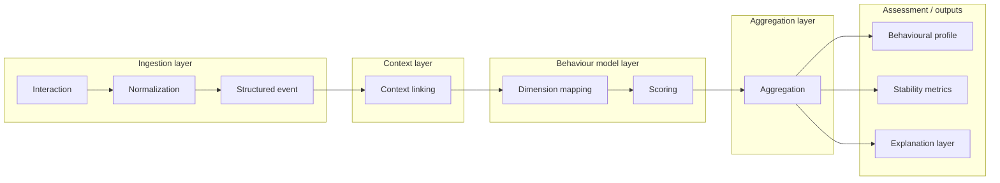

## DI360 — Decision Intelligence Infrastructure

DI360 is a decision intelligence infrastructure built for systems where behaviour emerges through interaction rather than isolated outputs. In most production systems today, decisions are still treated as atomic events. A model predicts, a user acts, an agent responds, and the system logs the result. This paradigm works only as long as the system remains simple. As soon as interactions become sequential, adaptive, and interdependent, this abstraction breaks down.

The limitation is not technological but conceptual. Systems capture what happened but not how behaviour evolved. Logs and metrics provide snapshots, but they do not preserve the structure of decision processes. As a result, systems appear observable while remaining behaviourally opaque.

DI360 addresses this gap directly. It introduces a layer that captures decision making as a structured process. Instead of focusing on isolated outputs, it models how decisions are formed, how they change across time, and how they interact with each other. This transforms behaviour from an implicit side effect into an explicit system property.

## Why modelling behaviour changes everything

The difference between tracking decisions and modelling behaviour becomes visible only at scale. In small systems, isolated outputs may be sufficient. In complex environments, they are not.

Consider a system where multiple agents interact with users under uncertainty. Each decision influences the next context. Over time, patterns emerge. These patterns may include increasing instability, inconsistent responses, or systematic escalation under pressure. None of these effects can be captured by analysing single events.

This is where most systems fail. They optimise for outcomes without understanding the behavioural process that produces them. This leads to systems that perform well in controlled conditions but degrade unpredictably in real environments.

DI360 changes this by making behaviour observable. It captures interactions as sequences, preserves context, and constructs a representation that allows behaviour to be analysed as it evolves. This enables a different class of questions. Not only what happened, but how the system behaves under pressure, how consistent it is across contexts, and how its behaviour changes over time.

## Conceptual model

DI360 is grounded in a pragmatic interpretation of behavioural systems. It draws from multi agent systems, where behaviour emerges through interaction, and from observability, where system properties must be reconstructable from structured signals.

At the same time, it avoids theoretical overreach. It does not attempt to infer hidden intentions or solve equilibrium models. Instead, it focuses on what can be observed directly: interactions, sequences, and patterns.

This leads to a model where behaviour is represented through dimensions such as decision velocity, risk orientation, uncertainty handling, and consistency. These dimensions are not fixed labels but dynamic signals derived from interaction data.

The key idea is simple. Behaviour is not a property of a single decision. It is a pattern across many decisions.

## Architecture

The architecture of DI360 is event driven. Every interaction is captured as a structured event that includes actor identity, context, timestamp, and payload. This event model forms the foundation of the system.

The processing pipeline consists of several stages. First, events are normalized to ensure consistency across sources. This allows the system to operate on heterogeneous data without losing structure. Next, events are linked to their context, preserving relationships and temporal ordering.

The mapping layer translates events into behavioural dimensions. A single event may contribute to multiple dimensions depending on its characteristics. For example, a rapid decision under uncertainty may affect both velocity and uncertainty handling.

The scoring layer converts these dimensions into signals. These signals represent measurable aspects of behaviour and are designed to be interpretable. Finally, the aggregation layer combines signals across time, producing a behavioural profile that reflects trends, variability, and stability.

This architecture ensures that behaviour is not inferred from isolated data points but constructed from sequences of interactions.

## System flow

interaction → normalization → context linking → mapping → scoring → aggregation → assessment

## Architecture diagram



## Event model

The event model is central to DI360 because it determines what behaviour can be reconstructed later. Each event captures both the action and its context.

```json
{
  "event_id": "evt_01",
  "actor_id": "agent_42",
  "context_id": "session_01",
  "timestamp": "2026-03-27T13:45:11Z",
  "event_type": "decision",
  "payload": {
    "latency_ms": 1820,
    "confidence": 0.61,
    "ambiguity": "high",
    "outcome": "escalate"
  }
}
```

By preserving this structure, DI360 allows behaviour to be analysed as a sequence rather than as isolated events.

## Behavioural dimensions and scoring

DI360 models behaviour through dimensions that capture how decisions are made. These include decision velocity, risk orientation, uncertainty handling, conflict response, and consistency.

Each dimension is derived from interaction data and updated continuously. A single event contributes to the signal, but meaningful patterns emerge only through aggregation. This allows the system to distinguish between noise and stable behavioural tendencies.

For example, repeated rapid decisions under high ambiguity may indicate a systematic tendency toward impulsive behaviour. Similarly, consistent responses across contexts may indicate stability. These interpretations are not imposed but emerge from the structure of the data.

## Scoring example

```python
def score(event):
    latency = event["payload"]["latency_ms"]
    velocity = 1.0 if latency < 2000 else 0.3

    outcome = event["payload"]["outcome"]
    risk = 0.7 if outcome == "escalate" else 0.2

    return {
        "decision_velocity": velocity,
        "risk_orientation": risk
    }
```

## API integration

```python
from fastapi import FastAPI

app = FastAPI()

@app.post("/events")
async def ingest(event: dict):
    normalized = normalize(event)
    dimensions = map_dimensions(normalized)
    signals = score(dimensions)
    result = aggregate(signals)
    return result
```

## Example output

```json
{
  "decision_profile": {
    "decision_velocity": "high",
    "risk_orientation": "elevated",
    "uncertainty_handling": "unstable"
  },
  "stability": {
    "trend": "decreasing",
    "variance": "high"
  },
  "explanation": {
    "signals": [
      "rapid decisions under ambiguity",
      "frequent escalation patterns",
      "inconsistent responses across similar contexts"
    ]
  }
}
```

## Technology

DI360 is implemented in Python, with FastAPI providing the integration layer and PostgreSQL serving as the underlying data store. This stack allows rapid iteration on behavioural models while maintaining production reliability.

The system is designed to operate on real interactions rather than simulated environments. This ensures that behavioural signals reflect actual system dynamics.

## Deployment and commercial model

DI360 can be deployed as a standalone service, integrated through an API, embedded within an existing product, or offered as a white label solution. This flexibility allows organisations to adopt it without restructuring their entire architecture.

The system is modular. Clients can define their own behavioural dimensions and scoring logic, making DI360 adaptable across domains. This is critical for commercial viability, as different applications require different interpretations of behaviour.

## Positioning

DI360 should be understood as infrastructure for observing decision behaviour. It is not an analytics tool focused on metrics, not an explainability layer focused on individual predictions, and not a simulation engine operating on synthetic data.

It operates on real interactions and constructs a representation of behaviour that is both interpretable and operationally useful. This makes it relevant in environments where interaction patterns determine system performance.

## Access and resources

The system is available in a working form and can be explored directly.

GitHub repository: https://github.com/MonikaDvorackova/di360 
Live system: https://di360ai.com  

These resources provide both the implementation and a reference for how DI360 behaves in practice.

## Final note

Most systems optimise decisions without understanding behaviour. DI360 reverses this order. It makes behaviour observable first and optimisation meaningful second.

This shift is not incremental. In systems where interaction defines outcomes, understanding behaviour is the only way to maintain control.