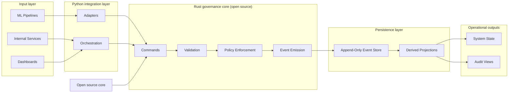

## Overview

GovAI exists because I got tired of the same lie showing up in different outfits: “we have governance.” What teams often mean is “we have a dashboard, some logs, a couple of approvals in a ticketing tool, and a vague belief that the thing in production is the thing that was evaluated.” That story survives exactly until the first real incident, the first time a model is rolled forward under pressure, the first time a prompt template changes without an obvious deploy, or the first time an auditor asks a question that begins with “why.”

LLM systems make the gap between “what we intended” and “what we deployed” measurable. Model weights, prompts, retrieval corpora, safety filters, evaluation harnesses, threshold configs, policy versions, approval records, and deployment gates drift independently. A mutable row that says “status = promoted” cannot carry the chain of admissibility that should have made promotion possible. Logs cannot carry it either, because logs describe what happened, not what was permitted to happen, and they do it from whichever service happened to emit a line before retention deleted the inconvenient parts.

GovAI is my attempt to make that gap unrepresentable. Not smaller. Not “managed.” Unrepresentable.

## Why I decided to build it

The moment I stopped treating governance as “process” and started treating it as “runtime semantics” was the moment it became solvable.

I kept seeing systems where policy existed as a PDF and enforcement existed as best-effort conventions. A pipeline run said “promotion passed.” A Slack thread said “approved.” A dashboard said “production uses model X.” Each artifact was plausible in isolation. None of them composed into a proof that the exact artifact now serving traffic was evaluated under the right harness, under the right thresholds, under the right policy regime, with approvals that actually applied to that artifact rather than a neighboring build or a stale snapshot.

Logs did not fix this. Logs are partial, lossy, and perspective-bound. Correlation IDs drift. Schemas change when a team is rushing. Retention policies erase the past right when the past becomes expensive. Even perfect logging still fails the actual question: what did the system have the right to do, under which policy semantics, at the moment the transition was attempted.

Mutable records made it worse. Updating a row makes the present legible but makes the past negotiable. Point-in-time restore can reconstruct what the database looked like. It cannot reconstruct why a transition was admissible unless admissibility is recorded as a first-class, durable claim.

Workflow tools did not fix it either. Approvals in a ticketing system are coordination, not enforcement. A checklist step that says “run evaluation” is not evidence that evaluation ran on the immutable artifact identity that later served traffic. Humans approve names. Systems deploy hashes. Governance collapses when those do not meet in a single enforced transition boundary.

Once that became obvious, governance stopped being theoretical. It became an engineering boundary the platform was missing.

## Architectural position

Event sourcing in GovAI is not there for style points. It is there because mutable state destroys auditability, and governance without auditability is cosplay.

Validation must happen before persistence. Recording an event is creating a durable historical claim. If the system records “model promoted” and later discovers the evaluation was missing or the approval was invalid, the system has already created audit debt it cannot pay down honestly. Deleting history is lying. Reinterpreting history is lying more quietly. The only acceptable response is rejection before persistence.

Governance cannot be an observational layer attached after execution. If governance sits downstream of the real transitions, it becomes an expensive narrative generator. A system either has an authoritative transition model or it does not. If it does not, “governance” becomes a set of tools that can tell you what is currently true while failing to justify why it was allowed to become true.

## Why this matters specifically for LLM systems

LLM platforms are uniquely good at producing governance failure modes while appearing operationally fine. Serving is measurable and usually stable. Provenance is volatile, asynchronous, and full of invisible coupling.

Orchestration complexity hides the thing governance needs to see. A deployment depends on a model artifact, a prompt template, a retrieval snapshot, a safety configuration, an evaluation run, a threshold configuration, and an approval regime that changes over time. Each piece can be “valid” on its own while the composition is invalid. Without an authoritative transition model, teams end up proving governance in screenshots.

Evaluation chains are deceptive. Harnesses change. Datasets change. Thresholds change. A later “pass” does not justify an earlier promotion, and an earlier “pass” does not justify a later promotion. If an evaluation is not bound to the immutable identity of the artifact being promoted and to the policy semantics that applied at the time, it is not governance evidence. It is trivia with an ID.

Approvals are a trap unless they are enforced at the moment of transition. Humans approve names. Systems deploy hashes. Governance collapses when approval records are not tied to immutable identities, policy regimes, separation-of-duties constraints, and revocation semantics.

Distributed responsibility makes drift inevitable. ML teams own evaluations, platform teams own deploys, security teams own policy, compliance teams own reporting. Each group implements a partial gate and assumes the others cover the rest. That is how “we did the right thing” becomes “nobody can prove what happened.”

## Model and persistence

GovAI treats governance as a state machine with explicit transitions. Commands express intent. Events express admitted reality. That separation is the boundary between “someone asked” and “the system agreed.”

Commands can be rejected without leaving residue. Events are append-only because an event is a historical claim: a transition was permitted under specific constraints and policy semantics at a specific time. Once recorded, that claim must remain inspectable.

Operational state exists as a projection. Projections exist because operators need queryable views, but projections are allowed to be rebuilt and verified. The event log is not allowed to be approximate.

The effective pipeline is:

| `event → validate → persist → derive state` |
|:--:|

If validation fails, nothing is recorded. If validation succeeds, the event is appended and projections update. That strictness is intentional. Governance is the wrong place to be permissive.

## Architecture



**`open source core → Rust governance core`**

Python lives at the boundary because ML infrastructure is Python-shaped in the real world. Pipelines, evaluators, artifact registries, and operational glue are built there. The constraint is hard: boundary code can authenticate, enrich, batch, and route, but it cannot decide admissibility.

Rust sits at the core because ambiguity is expensive and governance is full of edge cases that are easy to “handle later” until later becomes an audit or an outage. Strong typing forces domain concepts to be explicit. Exhaustive handling of error paths forces admission control to fail closed. The trade-off is higher iteration cost. That is the correct constraint for a component whose job is to prevent the platform from lying to itself.

PostgreSQL stores the event history and projections because governance is a consistency problem. An append plus projection update must behave predictably under retries and partial failures, and audit views are inherently relational over time, policy regimes, and artifact graphs. Operationally boring wins here.

## Stack reasoning with real trade-offs

Rust is used for the governance core because correctness is the product. It prevents “just this once” exceptions from metastasizing into policy debt by making the domain model explicit and making failure modes hard to ignore. The cost is real: extension requires design discipline and quick hacks are harder. Governance is exactly where quick hacks should be hard.

Python is used at the integration boundary because the ecosystem changes weekly. Evaluators get patched mid-incident. Pipelines are reconfigured by teams who will never read the core’s source. A boundary layer that cannot keep up becomes a bypass, and bypasses are how governance dies. Python keeps integration adaptable while the architecture keeps it non-authoritative.

PostgreSQL is chosen because this workload wants transactional durability and structured projections more than it wants novelty. It prevents the event history from becoming a pile of JSON blobs that only one service can interpret and operators can’t reason about. The price is relational discipline and migrations. That price is worth paying for a system that must survive bad days.

## Example event

A promotion event is where weak governance patterns go to die, because promotion is the moment the platform claims it earned the right to raise the stakes. GovAI treats this event as a historical claim that must be defensible from immutable history and the policy regime in force at the time.

```json
{
  "event_type": "model_promoted",
  "model_id": "model_123",
  "approved_by": "user_456",
  "evaluation_id": "eval_789",
  "timestamp": "2026-03-25T10:15:00Z"
}
```

Validity is not the presence of fields. The referenced evaluation must exist as prior validated history and must bind to the immutable identity of the artifact being promoted, not a neighboring build with the same display name. Threshold satisfaction must be evaluated under the policy configuration active at the time, not under a later interpretation after someone adjusted guardrails. Approvals must be admissible under the relevant regime, including separation-of-duties and revocation semantics that are easy to ignore until the day they matter. Lifecycle sequencing must remain consistent, preventing promotion when a block is active, when registration is incomplete, or when intermediate approvals are required but absent.

If the core cannot prove a prerequisite from history, the only acceptable outcome is rejection without persistence.

## Open source rationale

Governance infrastructure should not be opaque. A closed governance core asks everyone downstream to accept “trust me” as a substitute for semantics. That may work for product features; it does not work for a component whose job is to decide what is allowed to exist in durable history.

Open source here is not a marketing gesture. It is a constraint I want the system to live under. When admissibility changes, it should show up as code with a diff, a version, and a test surface rather than as an operational tweak that nobody can later correlate with why a transition was accepted. Inspectability makes validity falsifiable: given the same event stream and the same core version, replay should produce the same derived state or expose a real bug.

## Commercial reasoning

GovAI is infrastructure, not a feature, which is why it becomes embedded once adopted. Once a platform relies on an authoritative event history to determine admissible transitions, ripping it out means giving up deterministic reconstruction, giving up a centralized admission authority, and returning to a world where governance is assembled from partial artifacts.

Monetizable value sits above and around the verifiable core. The core should remain legible and replayable. Operational layers can be hardened and supported with availability guarantees, multi-tenant isolation, compliance-grade retention and access control, high-throughput boundary ingestion, projection packages tuned for audit workflows, and policy versioning plus controlled rollout under production load. The layering logic is intentional: keep semantics verifiable, then build operational value on top.

## Scope

GovAI provides technical governance primitives for AI lifecycle transitions. It accepts commands, evaluates admissibility against explicit invariants and policy regimes, appends only those transitions that can be justified from durable history, and maintains deterministic projections for operational use. The core is strict by design because strictness is the only reliable defense against the pressure to “just ship” and retroactively justify a production state later.

GovAI does not author policy, interpret legal requirements, certify compliance, or replace organizational decision-making. The system does not decide which rules should exist. It provides an enforcement boundary so that once rules are defined, transitions either meet them at the moment of execution or they do not happen.

## Deployment

The architecture is designed to survive multiple deployment models without changing its internal logic.

It can run as a standalone governance service, as part of an internal machine learning platform, or as the backend for dashboards and audit tooling. It can also support multi-tenant and white-label deployment models.

Across those variations, one architectural property remains stable: validation logic stays centralized in the Rust core and persistence remains event-first rather than state-first.

## Where this matters

Most systems I’ve seen can describe their current state. Very few can prove why that state is allowed to exist.

If you are building LLM or ML systems with evaluations, approvals, and deployments, you will eventually hit this. The moment something breaks, you will need to reconstruct the decision boundary that led there. Logs will not give you that answer.

Take your system and ask one question: can you deterministically prove why your current production state is valid using only durable history.

If not, treat it as a design flaw. Pick one transition and make it event-first. Validate it before it exists.

If this problem feels familiar, go read the repository and try it on a real slice of your system. And if you are already working on something similar or thinking about this space, reach out. I’m interested in people who take this problem seriously.

## Resources

Resources are linked below.